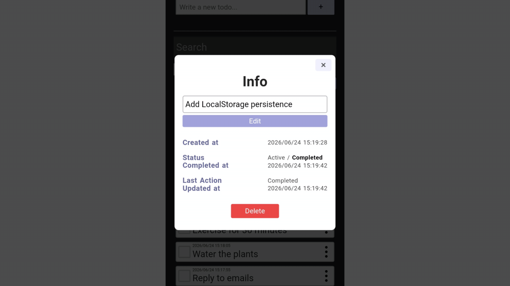

# Todo App
🚀 [Live Demo](https://lanlanwi-todo-app.pages.dev/)

🗃 [Source Code](https://github.com/lanlanwi/todo-app/tree/main/src)

## Screenshot

### Mobile

### Desktop

## Features

### Task Management

- Create tasks
- Edit tasks
- Delete tasks
- Mark tasks as completed
- View task status

### Search & Organization

- Search tasks by keyword
- Filter tasks by status
- Sort tasks dynamically

### Metadata Tracking

Each task stores:

- Created At
- Updated At
- Completed At
- Status
- Last Action

### User Experience

- Responsive design for mobile and desktop devices
- Clean and minimal user interface
- Persistent storage with LocalStorage

## Built With

- React(Vite)
- JavaScript
- CSS

## License
This project is licensed under the MIT License.