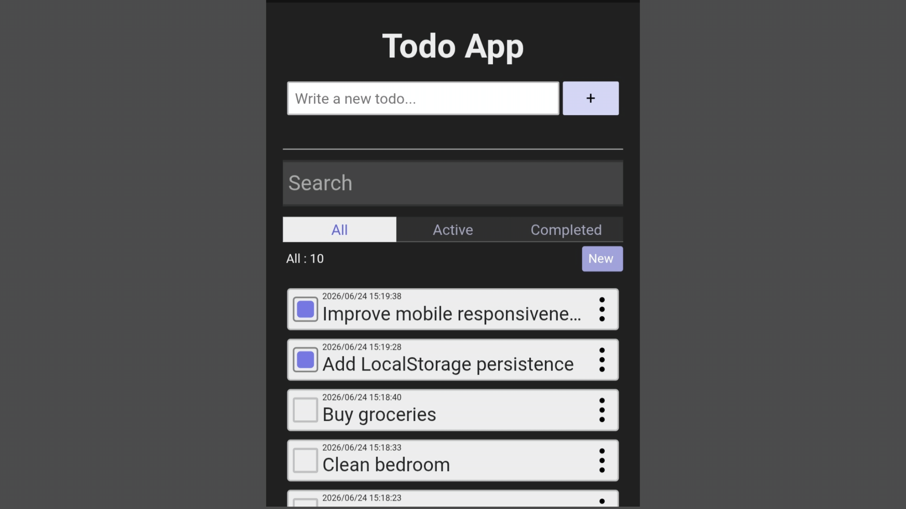
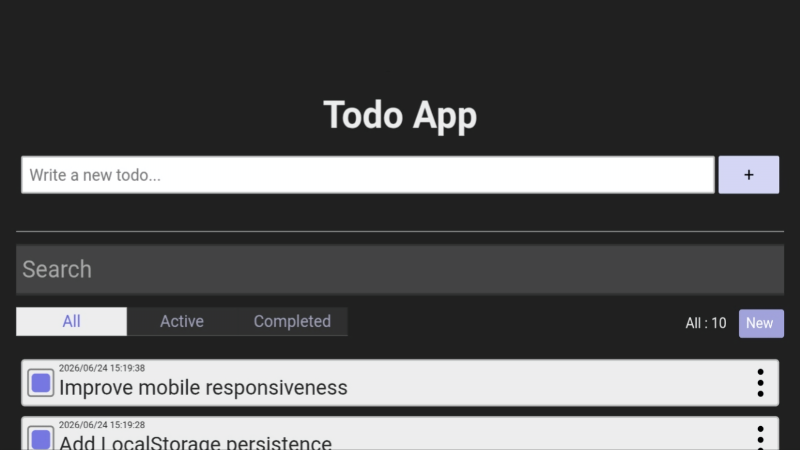
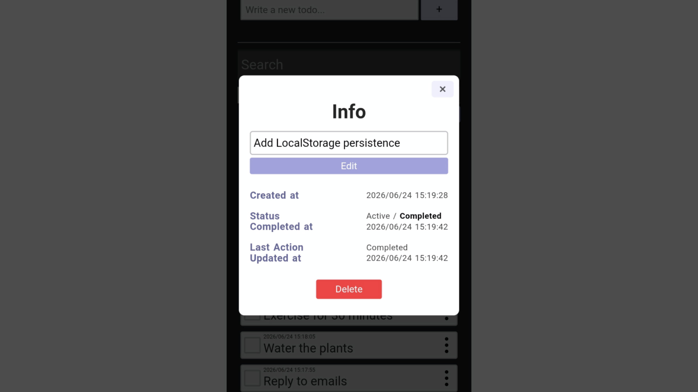

# Todo App

🚀 [Live Demo](https://lanlanwi-todo-app.pages.dev/)

🗃 [Source Code](https://github.com/lanlanwi/todo-app)

## 📸 Screenshot

### 📱 Mobile

### 💻 Desktop

## ⚙️ Features

### 🔧 Task Management

- Create tasks
- Edit tasks
- Delete tasks
- Mark tasks as completed
- View task status

### 🔍 Search & Organization

- Search tasks by keyword
- Filter tasks by status
- Sort tasks dynamically

### 🗒 Metadata Tracking

Each task stores:

- Created At
- Updated At
- Completed At
- Status
- Last Action

### 👍 User Experience

- Responsive design for mobile and desktop devices
- Clean and minimal user interface
- Persistent storage with LocalStorage

## 🔩 Built With

- React
- TypeScript
- Vite
- CSS3
- LocalStorage API

## 📡 Deployment

Hosted on Cloudflare Pages

## 👨‍🎓 What I Learned

- Building React applications with TypeScript
- Creating reusable types for components and hooks
- Using type-safe React Hooks (`useState`, custom hooks)
- State management with React Hooks
- Data persistence using LocalStorage
- Search, filtering, and sorting logic
- Responsive UI design
- Component-based architecture

## ✨ TypeScript Migration

This project was originally built with JavaScript and later migrated to TypeScript.

The migration improved:

- Type safety
- Better code readability
- Easier maintenance
- Safer component props and custom hooks

## 🔒 License

This project is licensed under the MIT License.
